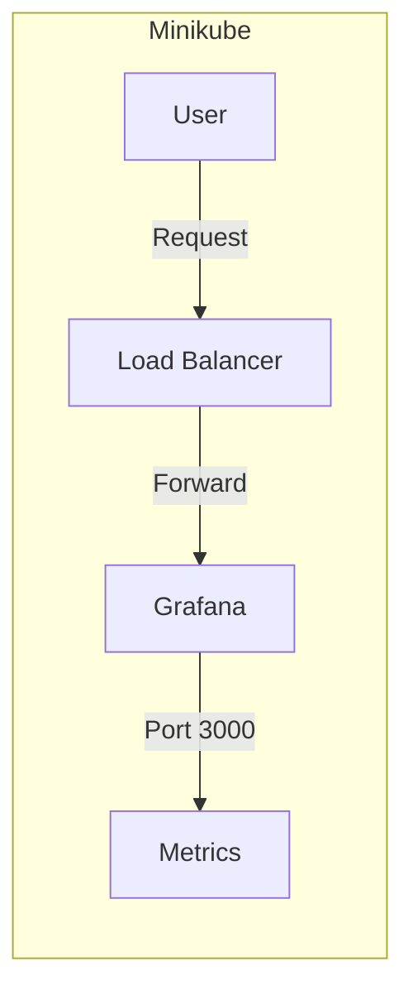

# Load Balancer Implementation Diagram

```mermaid
graph TD
    subgraph Minikube
        direction TB
        A[User] -->|Request| B[Load Balancer]
        B -->|Forward| C[Grafana]
        C -->|Port 3000| D[Metrics]
    end
```
