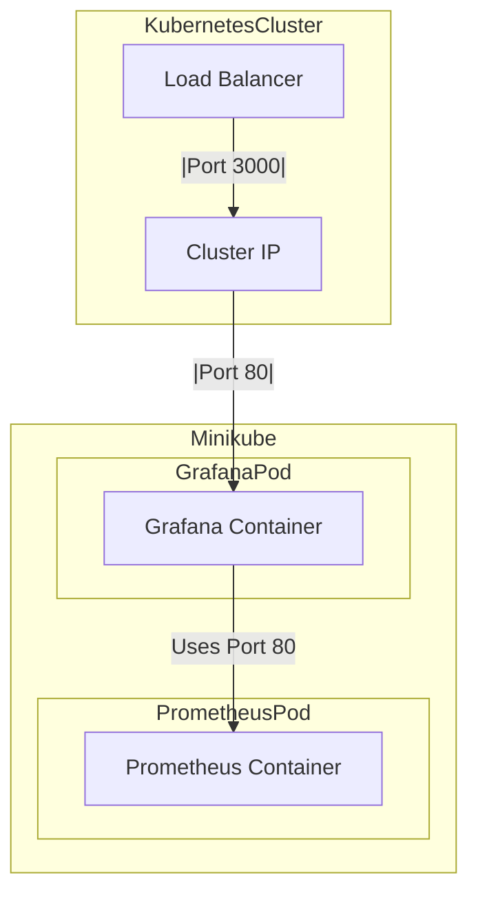

Windows H > Text to Speech

Create me a mermaid chart for Kubernetes structure. In that structure, what I'm expecting is one Minikube, and in that Minikube, there is going to be one pod that is going to run Grafana. It is going to get connected to Prometheus. They are going to use the most used ports, 3000 and port 80. There's going to be a load balancer, but communication is going to be over a cluster IP port.

Here's a Mermaid diagram for your Kubernetes structure, based on the requirements. This will include a Minikube instance, a pod for Grafana connected to Prometheus, with the respective ports, and a load balancer communicating over a ClusterIP:

### Explanation:

- **Minikube** contains the structure for both **GrafanaPod** and **PrometheusPod**.
- **GrafanaPod** is running **Grafana** and communicates with **Prometheus** over Port 80.
- **Load Balancer** sends traffic to **Grafana** over Port 3000 through **ClusterIP**, which handles internal communication.
