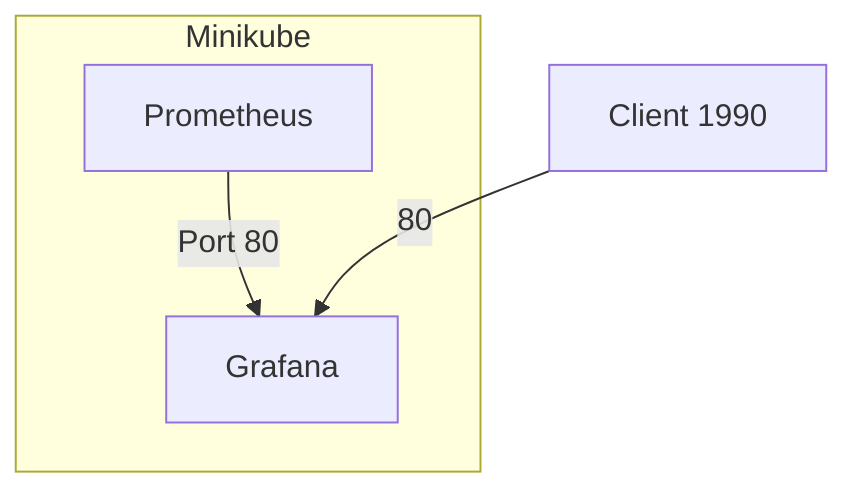

Live Helper
https://mermaid.live/




Sample Implementation
graph TD
    %% Define components
    A[Load Balancer]
    B[Codespaces]
    C[minikube]
    D[ClusterIP - 10.101.112.72]
    E[pod - localhost (Green)]
    F[pod - localhost (Red)]
    G[Grafana]
    H[Prometheus]
    I[Git]
    
    %% Define connections
    A --> B
    B --> C
    C --> D
    D --> E
    D --> F
    E --> G
    F --> H
    H --> I
    I --> C
    I -- pull/push --> D

    %% Labels
    classDef pod fill:#f96,stroke:#333,stroke-width:2px;
    classDef service fill:#0f6,stroke:#333,stroke-width:2px;
    
    class E,F pod
    class D service
    ```mermaid
    graph TD
        subgraph Kubernetes Cluster
            direction TB
            A[Load Balancer]
            B[Codespaces]
            C[minikube]
            D[ClusterIP - 10.101.112.72]
            E[pod - localhost (Green)]
            F[pod - localhost (Red)]
            G[Grafana]
            H[Prometheus]
            I[Git]
        end

        %% Define connections
        A --> B
        B --> C
        C --> D
        D --> E
        D --> F
        E --> G
        F --> H
        H --> I
        I --> C
        I -- pull/push --> D

        %% Labels
        classDef pod fill:#f96,stroke:#333,stroke-width:2px;
        classDef service fill:#0f6,stroke:#333,stroke-width:2px;
        
        class E,F pod
        class D service
    ```